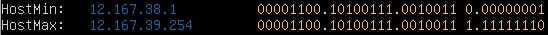
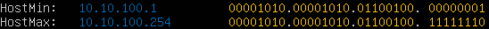
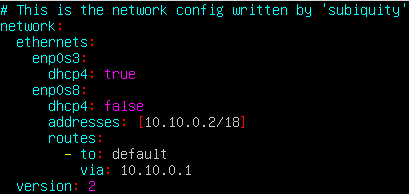
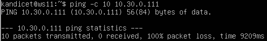
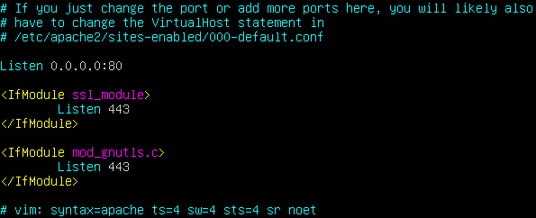

## Part 1. Инструмент **ipcalc**

- Установим утилиту `ipcalc` с помощью команды `sudo apt install ipcalc`  

#### 1.1 Сети и маски

1. Определяем адрес сети `192.167.38.54/13` с помощью `ipcalc`
   
   `

2. Переводим маску `255.255.255.0` в префискную и двоичную запись, `/15` в обычную и двоичную, `11111111.11111111.11111111.11110000` в обычную и префиксную
   
   
   
   *маска подсети в префиксной и двоичной записи*
   
   
   
   *маска `/15` в обычной и двоичной записи*
   
   
   
   *маска `11111111.11111111.11111111.11110000`  в обычной записи*
   
   
   
   *маска `11111111.11111111.11111111.11110000` в префиксной записи*

3. Определяем минимальный и максимальный хост в сети `12.167.38.4` при масках: `/8`, `1111111.11111111.00000000.00000000`, `255.255.254.0` и `/4`
   
   Командой `ipcalc 12.167.38.4/8` определяем минимальный и максимальный хост сети при маске `/8`:
   
   
   
   Командой `ipcalc 12.167.38.4/16` определяем минимальный и максимальный хост сети при маске `1111111.11111111.00000000.00000000`:
   
   
   
   Командой `ipcalc 12.167.38.4/255.255.254.0` определяем минимальный и максимальный хост сети при маске `255.255.254.0`:
   
   
   
   Командой `ipcalc 12.167.38.4/4` определяем минимальный и максимальный хост сети при маске `/4`:
   
   

#### 1.2 localhost

- Приложение, работающее на `localhost`, обычно ссылается на IP-адрес `127.0.0.1`.  Значит, приложение доступно только для запросов, исходящих с той же машины, на которой оно запущено

- **`194.34.23.100`**- это внешний IP-адрес, обращение к приложению на `localhost` с этого адреса **невозможно**

- **`127.0.0.2`** - это адрес в диапазоне `127.0.0.0/8`, который относится к `localhost`, обращение к приложению на `localhost` **возможно**

- **`127.1.0.1`** - это адрес в диапазоне `127.0.0.0/8`, который относится к `localhost`, обращение к приложению на `localhost` **возможно**

- **`128.0.0.1`** - это адрес не находится в диапазоне `127.0.0.0/8` и является публичным IP-адресом, обращение к приложению на `localhost` **невозможно**

#### 1.3 Диапозоны и сегменты сетей

1. Для определения, какие IP являются публичными, а какие - частными, нужно учитывать диапазоны частных IP-адресов, которые установлены в стандарте RFC 1918:
   
   - **`10.0.0.0 - 10.255.255.255`** `(10.0.0.0/8)`
   
   - **`172.16.0.0. - 172.31.255.255`** `(172.16.0.0/12)`
   
   - **`192.168.0.0 - 192.168.255.255`** `(192.168.0.0/16)` 
   
   Также определить какие IP являются публичными, а какие - частными можно с помощью утилиты `ipcalc`.
   
   - **Частные IP-адреса**:
     
     - 10.0.0.45
     
     - 192.168.4.2
     
     - 172.20.250.4
     
     - 172.16.255.255
     
     - 10.10.10.10
   
   - **Публичные IP-адреса**:
     
     - 134.43.0.2
     
     - 172.0.2.1 (специальный, для документации)
     
     - 192.172.0.1
     
     - 172.68.0.2
     
     - 192.169.168.1

2. Используем утилиту `ipcalc` для определения возможных шлюзов в сети `10.10.0.0/18`
   
   
   
   *Вывод команды `ipcalc 10.10.0.0/18`*
   
   - На основе вывода можно определить, что возможные адреса шлюзов находятся в диапазоне от `10.10.0.1` до `10.10.63.254`
   
   - Теперь можем проверить каждый IP-адрес
     
     
     
     *Диапазон шлюзов для `10.0.0.1`*
     
     
     
     *Диапазон шлюзов для `10.10.0.2`*
     
     
     
     *Диапазон шлюзов для `10.10.10.10`*
     
     
     
     *Диапазон шлюзов для `10.10.100.1`*
     
     
     
     *Диапазон шлюзов для `10.10.1.255`*
   
   - Таким образом, возможные IP-адреcа шлюза для сети `10.10.0.0/18`: **`10.10.0.2`, `10.10.10.10` и `10.10.1.255`**

## Part 2. Статическая маршрутизация между двумя машинами

- Просматриваем текущие сетевые интерфейсы с помощью команды `ip a`
  
  
  
  *Сетевые интерфейсы `ws1`*
  
  
  
  *Сетевые интерфейсы `ws2`*

- С помощью команды `sudo vim /etc/netplan/00-installer-config.yaml` заходим в конфигурационный файл и ставим соотвествующие адреса и маски машинам `ws1` и `ws2`
  
  
  
  *Статический адрес `ws1`*
  
  
  
  *Статический адрес `ws2`*

- Перезапускаем сервис сети для принятия изменений командой `sudo netplan apply` и проверяем установленные статические адреса командой `ip a`
  
  
  
  *IP-адрес `ws1`*
  
  
  
  *IP-адрес `ws2`*

#### 2.1 Добавление статического маршрута вручную

- Добавим статическую маршрутизацию с помощью команды `sudo ip route add` для каждой из машин, указывая соответсвующие другой машине IP-адреса
  
  
  
  *Статическая маршрутизация` ws1`*
  
  
  
  *Статическая маршрутизация `ws2`*

- Пропингуем соединение между машинами командой `ping -c 10 <address>` (перед этим необходимо переключить в VirtualBox настройки сети для каждой машины на `internal network`)
  
  
  
  *Пинг `ws1`*
  
  
  
  *Пинг `ws2`*

#### 2.2 Добавление статического маршрута с сохранением

- При перезапуске машины происходит сброс маршрутизации, для сохранения параметров маршрута редактируем конфигурационный файл `/etc/netplan/00-installer-config.yaml`
  
  
  
  *Сохранения параметров маршрута `ws1`*
  
  
  
  *Сохранения параметров маршрута `ws2`*

- Применяем изменения командой `sudo netplan apply` и пропингуем соединение
  
  
  
  *Пинг c `ws1`*
  
  
  
  *Пинг c `ws2`*

## Part 3. Утилита **iperf3**

#### 3.1 Скорость соединения

- 8 Mbps (мегабит в секуду) = 1 MB/s (мегабайт в секунду)

- 100 MB/s (мегабайт в секунду) = 800 000 Kbps (килобит в секунду)

- 1 Gbps (гигабит в секунду) = 1 000 Mbps (мегабит в секунду)

#### 3.2 Утилита iperf3

- Для установки утилиты `iperf3` необходимо подключение к сети Интернет. Для этого в настройках сети виртуальных машин включаем второй адаптер NAT, а затем редактируем конфигурационный файл `/etc/netplan/00-installer-config.yaml`, добавляя в него запись:
  
  

- Устанавливаем утилиту `iperf3` с помощью команды `sudo apt install iperf3`. Запускаем утилиту на машине ws2 для прослушаивания в качестве сервера командой `iperf3 -s`, а на машине ws1 используем команду клиентской стороны `iperf3 -c`
  
  
  
  *Используем `ws2` в качестве серверной стороны*
  
  
  
  *Используем `ws1` в качестве клиентской стороны*

## Part 4. Сетевой экран

#### 4.1 Утилита iptables

- Создаем файл `/etc/firewall.sh`, имитирующий файрвол, на `ws1` и `ws2`
  
  
  
  *Правила для `ws1`*
  
  
  
  *Правила для `ws2`*

- Запускаем файлы на обеих машинах командами `sudo chmod +x /etc/firewall.sh` и `/etc/firewall.sh` и выполняем команду `sudo iptables --line-numbers -L -v -n` для подтверждения добавления правил

- Такая стратегия ограничения доступа на выход позволяет первой машине пинговать, а второй нет, поскольку правила выполняются сверху вниз
  
  #### 4.2 Утилита nmap

- Пропингуем хосты внутри локальной сети машин `ws1` и `ws2`, как видно, правила не позволяют пинговать машине 2
  
  
  
  *Пинг машины `ws2`*
  
  
  
  *Пинг машины `ws1`*

- Для проверки, что хост работает, но при этом не пингуется используем утилиту `nmap`. Установим ее командой `sudo apt install nmap`. Вызываем команду `nmap` на `ws1`, наблюдается, что хост работает, но не пингуется
  
  
  
  *Работа утилиты `nmap` на `ws1`*

- Выполняем сохранение состояния виртуальных машин
  
  
  
  *Снимок ws1*
  
  
  
  *Снимок `ws2`*

## Part 5. Статическая маршрутизация сети

- Поднимаем 5 виртуальных машин (3 рабочие станции (`ws11`, `ws21`, `ws22`) и 2 роутера (`r1`, `r2`))
  
  

#### 5.1 Настройка адресов машин

- Для каждой машины прописываем настройки сети в файле `/etc/netplan/00-installer-config.yaml` в соответствии с заданием и принимаем изменения командой `sudo netplan apply`
  
  
  
  *`ws11`*
  
  
  
  *`ws21`*
  
  
  
  *`ws22`*
  
  
  
  *`r1`*
  
  
  
  *`r2`*

- Проверяем, что адреса машин заданы верно командой `ip -4 a`
  
  
  
  *`ws11`*
  
  
  
  *`ws21`*
  
  
  
  *`ws22`*
  
  
  
  *`r1`*
  
  
  
  *`r2`*

- Пропингуем `ws22` с `ws21`, а также `r1` с `ws11`
  
  
  
  *пинг `ws22` с `ws21`*
  
  
  
  *пинг `r1` с `ws11`*

#### 5.2 Включение переадресации IP-адресов

- Включаем переадресацию IP на роутерах командой `sudo sysctl -w net.ipv4.ip_forward=1`
  
  
  
  *`sysctl r1`*
  
  
  
  *`sysctl r1`*

- При таком подходе переадесация не будет работать после перезапуска системы, для включения переадресации на постоянной основе внесем изменения в файл `/etc/systcl.conf`
  
  
  
  *редактирование `sysctl.conf r1`*
  
  
  
  *редактирование `sysctl.conf r2`*

#### 5.3. Установка маршрута по-умолчанию

- Устанавливаем маршрут по-умолчанию для рабочих станций, добавляем ip роутера в файл `/etc/netplan/00-installer-config.yaml`
  
  
  
  *`ws11`*
  
  
  
  *`ws21`*
  
  
  
  *`ws22`*

- Проверяем добавление шлюза в таблицу маршрутизации командой `ip r`
  
  
  
  *`ip r ws11`*
  
  
  
  *`ip r ws21`*
  
  
  
  *`ip r ws22`*

- Пропингуем с `ws11` роутер `r2`, однако наблюдаем, что роутер не возвращает ответ, хотя и принимает запрос
  
  

- Проверяем это, запуская команду `sudo tcpdump -tn -i enp0s8` на `r2` и снова пингуем с `ws11` командой `ping -c 5 <address>`
  
  
  
  *Результат при вызове `tcpdump` на `r2` и пинге c `ws11`*

#### 5.4. Добавление статических маршрутов

- Для добавления статических маршрутов отредактируем файл `/etc/netplan/00-installer-config.yaml` на обоих роутерах
  
  
  
  *`r1`*
  
  
  
  *`r2`*

- Вызовем таблицу маршрутизации для `r1` и `r2` командой `ip r`
  
  
  
  *`r1`*
  
  
  
  *`r2`*

- Вызываем команды `ip r list 10.10.0.0/18` и `ip r list 0.0.0.0/0`
  
  

- Для адреса `10.10.0.0/18` был выбран маршрут, отличный от `0.0.0.0/0` (маршрут по-умолчанию), так как машина `ws11` соединена с сетью `10.10.0.0/18` по своему IP-адресу `10.10.0.2`, для других адресов используется маршрут по умолчанию (`10.10.0.1`)

#### 5.5 Построение списка маршрутизаторов

- Запустим на роутере `r1` команду `sudo tcpdump -tnv -i enp0s8` и пропингуем соединение от `ws11` до `ws21` командой `ping -c 10 10.20.0.10`
  
  

- Построим список маршрутизации от `ws11` до `ws21` с помощью команды `traceroute 10.20.0.10`
  
  

- Инструмент traceroute отправляет пакеты на IP-адрес назначения и со сроком жизни (TTL), установленным на 1, соответственно, первый маршрутизатор, на который придут пакеты, отправит обратно ошибку ("время превышено"). При возврате ошибки инструмент traceroute записывает идентификатор первого маршрутизатора и время приема-передачи, увеличивает TTL и отправляет новые пакеты, повторяя этот процесс до тех пор, пока последний пакет не достигнет IP-адреса назначения или два набора пакетов не будут отклонены. Таким образом инструмент позволяет определить путь, по которому проходят ваши пакеты, и время в оба конца до каждого перехода, чтобы вы могли устранить потерю пакетов и задержку.

#### 5.6 Использование протокола **ICMP** при маршрутизации

- Запускаем на `r1` команду `tcpdump -n -i enp0s8 icmp` для перехвата сетевого траффика и пингуем несуществующий IP с `ws11`
  
  
  
  

- Выполняем сохранение состояния виртуальных машин

## Part 6. Динамическая настройка IP с помощью **DHCP**

- Для начала работы с DHCP сервером устанавливаем его командой `sudo apt install isc-dhcp-server`

- Далее настраиваем для `r2` в файле `/etc/dhcp/dhcpd.conf` конфигурацию службы DHCP: указываем адрес маршрутизатора по-умолчанию, DNS-сервер и адрес внутренней сети
  
  
  
  *`r2`*

- Прописываем nameserver `8.8.8.8` в файле `/etc/resolv.conf` и перезагружаем службу DHCP командой `systemctl restart isc-dhcp-server`
  
  
  
  *`r2`*
  
  

- Для того, чтобы `ws21` получала динамические адреса следует отредактировать файл `/etc/netplan/00-installer-config.yaml` и поставить `dhcp true`
  
  

- Вызываем команду `ip a` на машине `ws21` и наблюдаем динамическое присвоение адреса
  
  

- Пингуем `ws22` с `ws21`
  
  

- Прописываем на машину `ws11` MAC адрес в `etc/netplan/00-installer-config.yaml`
  
  

- Ставим на `r1` как и на `r2` `dhcp-server` командой `sudo apt-get install isc-dhcp-server`, редактируем файл `/etc/dhcp/dhcpd.conf` с жесткой привязкой к MAC следующим образом
  
  

- Редактируем файл `/etc/resolv.conf`, внося данные о DNS-сервере
  
  

- Перезапускаем DHCP-службу командой `systemctl restart isc-dhcp-server`
  
  

- Проверяем назначение IP-адреса, привязанного к MAC, у машины `ws11` командой `ip a`
  
  

- Пропингуем `ws22` с `ws11`
  
  

- Проверяем текущий `ip` на `ws21` командой `ip a`
  
  

- Освобождаем текущий IP командой `sudo dhclient -r` и получаем новый командой `sudo dhclient` и проверяем назначение нового адреса командой `ip a`
  
  

## Part 7. **NAT**

- Устанавливаем `Apache2` командой `sudo apt install apache2` на машинах `r1` и `ws22`, меняем порт `80` на `0.0.0.0:80` в файле `/etc/apache2/ports.conf` на обеих машинах
  
  
  
  *`ws22`*
  
  
  
  *`r1`*

- Запускаем сервер Apache2 командой `service apache2 start` на обеих машинах
  
  
  
  *`ws22`*
  
  
  
  *`r1`*

- На машине `r2` создаем `firewall` с помощью команды `sudo touch /etc/firewall.sh` и добавляем следующие правила:
  
  - Удаление правил в таблице `filter` — `iptables -F`
  
  - Удаление правил в таблице «NAT» — `iptables -F -t nat`
  
  - Отбрасывать все маршрутизируемые пакеты — `iptables --policy FORWARD DROP`
    
    

- Запускаем `firewall` командами `chmod +x /etc/firewall.sh` и `/etc/firewall.sh` и проверяем добавление правил командой `sudo iptables --line-numbers -L -v -n`
  
  

- Пропингуем `ws22` с `r1` и видим, что она не пингуется
  
  

- Добавляем в `firewall` правило, разрешающее маршрутизацию пакетов по протоколу `ICMP`
  
  

- Снова пропингуем `ws22` с `r1`, в этот раз `ws22` пингуется
  
  

- Добавляем в `/etc/firewall.sh` правила `SNAT` и `DNAT` на машине `r2`
  
  

- Отключаем сетевой интерфейс NAT в Virtual Box и запускаем firewall `chmod +x /etc/firewall.sh` и `/etc/firewall.sh`, запускаем команды `telnet 10.100.0.11 80` на машине `ws22` и `telnet 10.100.0.12 8080` на `r1`. В случае `r1` подключаемся к `ws22` через сетевой интерфейс `r2`
  
  
  
  *`ws22`*
  
  
  
  *`r1`*

## Part 8. Дополнительно. Знакомство с **SSH Tunnels**

- Запускаем firewall из части 7 командами `chmod +x /etc/firewall.sh` и `/etc/firewall.sh` и меняем веб-сервер Apache2 на `ws22`, только на `localhost`, отредактировав файл `/etc/apache2/ports.conf`
  
  
  
  *`ws22`*  

- Запускаем `ssh` на `ws22` командой `sudo systemctl start ssh`, затем открываем `ssh` соединение на `ws21` c сервером на `ws22` (Local TCP forwarding)
  
  
  *`ws21`*  
  
  
  
  *`ws21`*  

- Проверяем запущенный процесс на `ws22`
  
  
  
  *`ws22`*  

- Чтобы получить доступ к веб-серверу на `ws22` с `ws11` используем Remote TCP forwarding командой `ssh -R 8080:localhost:80 10.20.0.20`
  
  
  
  *`ws11`*  
